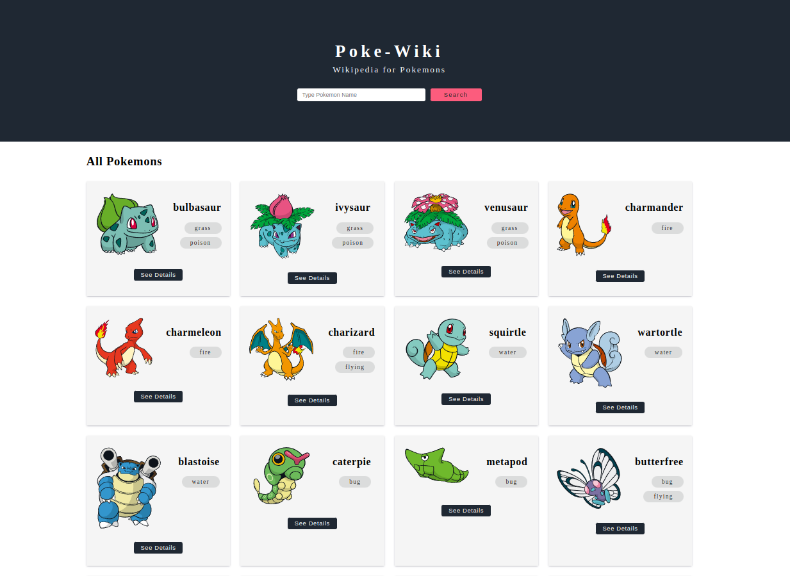

# Poke-Wiki: Wikipedia for Pokemons

Pokemon wikipedia application using the popular https://pokeapi.co API.

---

### UI Screenshots




---

### How to Run

#### Step 01: Clone the project using 

```
git clone https://github.com/DevRezaur/poke-wiki.git
```
or 

```
git clone git@github.com:DevRezaur/poke-wiki.git
```

#### Step 02: Navigate inside the project folder 'poke-wiki' and type the command to install the required packages and dependencies

```
npm install
```

#### Step 04: Run the project using

```
ng serve
```

### Have a nice day
